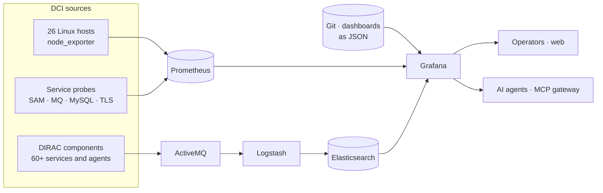
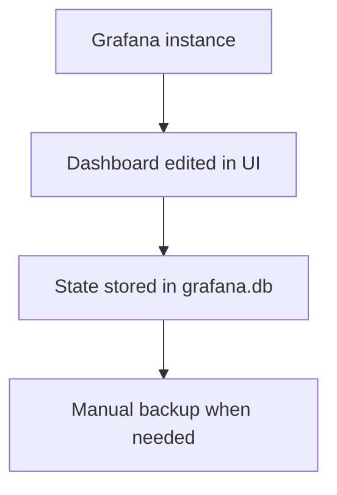
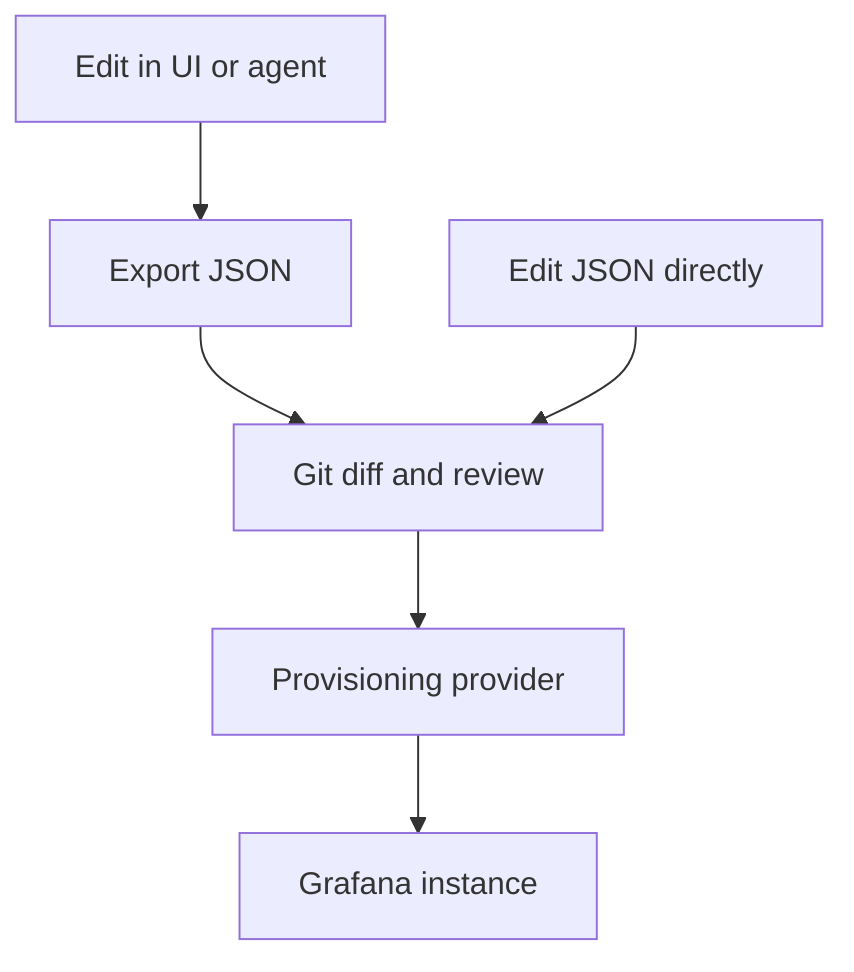
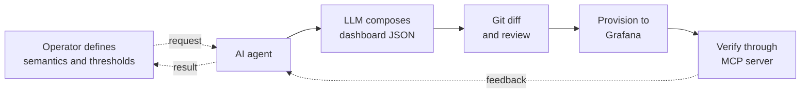
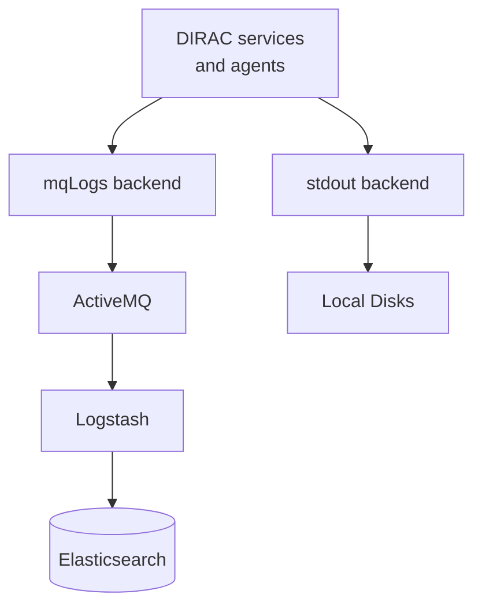

# Monitoring for the<br/>Distributed Computing Infrastructure

#### Automated dashboards, SAM tests, DIRAC logs, and infrastructure

<br>

**Xiao Han** on behalf of the IHEP DCI Group · <a href="mailto:hanx@ihep.ac.cn">hanx@ihep.ac.cn</a>

<br>

**CEPC Computing Preparation** · September 2026 · *IHEP, Beijing*

<a href="https://dci-grafana.ihep.ac.cn/"><mdi-view-dashboard-outline /> DCI Grafana</a>
 · <a href="https://github.com/hanx-hep/28th-junocm-dci"><mdi-history /> JUNO case study</a>


<!--
Timing: 0:30

Good afternoon. I am Xiao Han, speaking on behalf of the DCI Group. CEPC computing will need production monitoring from its first day of data taking. We are building that monitoring now, as shared infrastructure, and we prove every piece of it on the live JUNO DCI. This talk covers four things: automated Grafana dashboards, SAM test optimization, DIRAC log monitoring and its plan, and monitoring of the infrastructure itself.
-->
---
layout: default
---

# Monitoring as infrastructure, not per experiment

The monitoring CEPC will need on day one is being built **now**, as shared DCI infrastructure,
and validated daily on the **JUNO DCI** — today's production testbed.

<div class="takeaway mt-3">
<strong>One stack, proven on JUNO</strong> — CEPC inherits a running system, not a project.
</div>

<div class="three-cards mt-4">
  <div class="story-card">
    <mdi-source-branch class="story-icon" />
    <h2>Reproducible</h2>
    <p>Every dashboard is JSON in Git; changes are reviewed, versioned, and deployable again from scratch.</p>
  </div>
  <div class="story-card">
    <mdi-layers-search class="story-icon" />
    <h2>Integrated</h2>
    <p>Probes, metrics, and logs meet in one Grafana — a fault is seen with its context, not in a separate portal.</p>
  </div>
  <div class="story-card">
    <mdi-transit-connection-variant class="story-icon" />
    <h2>Transferable</h2>
    <p>Onboarding an experiment means adding targets and dashboards — no new monitoring system to build.</p>
  </div>
</div>


<!--
Timing: 0:55

Here is the main message. CEPC data taking will run on distributed computing infrastructure, and monitoring must exist on day one. Our approach is to build it as DCI infrastructure now, and to validate every part on the JUNO DCI, which is in production today. Three properties matter. The system is reproducible: dashboards are JSON in Git. It is integrated: probing, metrics, and logs meet in one place. And it is transferable: a new experiment adds targets and dashboards instead of building a new system.
-->
---
layout: default
---

# One stack, three layers — experiment-agnostic



<div class="architecture-legend">
  <span><strong>Collect</strong><br/>hosts, probes, logs</span>
  <span><strong>Integrate</strong><br/>Prometheus · Elasticsearch · Grafana</span>
  <span><strong>Act</strong><br/>humans and agents, same evidence</span>
</div>


<!--
Timing: 1:05

This is the whole stack on one slide. On the left are the sources: twenty-six Linux hosts export metrics, service probes check availability, and more than sixty DIRAC components produce logs. The middle is integration: Prometheus stores metrics, and logs travel through ActiveMQ and Logstash into Elasticsearch. Grafana reads both, and its dashboards come from Git. On the right are the consumers: operators through the web, and AI agents through the MCP gateway. Nothing in this picture is experiment-specific. Onboarding CEPC means adding sources and dashboards, not new layers.
-->
---
layout: section
---

# 1 · Dashboards as code


<!--
Timing: 0:10

The first part is how dashboards are produced and delivered: automatically, under review.
-->
---
layout: default
---

# Dashboard delivery is a review pipeline

<div class="cols mt-2">
  <div>

## Before · instance state



<div class="takeaway compact mt-3">
Dashboard data lived only in the instance database — hard to review, reproduce, or transfer to a new experiment.
</div>

  </div>
  <div>

## Now · Git delivery path



<div class="takeaway compact mt-3">
Each dashboard is a JSON file in Git; the provider syncs it into Grafana every 30 seconds.
</div>

  </div>
</div>


<!--
Timing: 1:00

The left side is the old method. Dashboards were edited in the UI and stored inside the Grafana database. That worked for one instance, but changes could not be reviewed, and nothing could be transferred. The right side is the current pipeline. We edit in the UI or through an agent, export the JSON, review the diff in Git, and the provisioning provider loads the reviewed file into Grafana within thirty seconds. For CEPC this means the dashboard set is a repository that can be cloned, reviewed, and deployed — not a database to be migrated.
-->
---
layout: default
---

# 31 dashboards under version control today

<div class="provider-grid mt-3">
  <div class="provider"><strong>10</strong><span>Admin</span></div>
  <div class="provider"><strong>9</strong><span>DIRAC</span></div>
  <div class="provider"><strong>6</strong><span>TPC</span></div>
  <div class="provider"><strong>4</strong><span>User</span></div>
  <div class="provider"><strong>2</strong><span>Shift</span></div>
</div>

<div class="delivery-loop mt-5">
  <div><small>CREATE</small><strong>UI or agent</strong></div>
  <mdi-arrow-right />
  <div><small>CAPTURE</small><strong>Dashboard JSON</strong></div>
  <mdi-arrow-right />
  <div><small>CONTROL</small><strong>Git review</strong></div>
  <mdi-arrow-right />
  <div><small>RECONCILE</small><strong>30 s refresh</strong></div>
</div>

<div class="two-notes mt-5">
  <div><strong>Five providers</strong><br/>Admin, DIRAC, TPC, User, and Shift reconstruct the whole folder layout from version-controlled JSON.</div>
  <div class="warning-note"><strong>Guard against drift</strong><br/><code>allowUiUpdates: true</code> keeps UI editing convenient; export → review → commit must remain the return path to Git.</div>
</div>


<!--
Timing: 1:00

Today the repository holds thirty-one dashboard files under five providers. The delivery loop has four steps: create, capture as JSON, review in Git, and reconcile in Grafana every thirty seconds. UI editing stays enabled, so the return path matters: any UI edit must be exported and committed, or the instance and the repository drift apart. This loop is the control point that CEPC dashboards will go through as well.
-->
---
layout: default
---

# AI accelerates the loop; humans keep control



<div class="two-notes mt-4">
  <div><strong>What the agent repeats</strong><br/>Panel structures, queries, transformations, variables, and layouts — across many similar dashboards.</div>
  <div><strong>What the operator keeps</strong><br/>Domain meaning, grading thresholds, approval of the diff, and the decision to act.</div>
</div>

<div class="takeaway mt-4">
This is how the <strong>SAM v4</strong> availability view and the improved <strong>TPC transfer matrix</strong> were produced — agent-built JSON, human-reviewed, provisioned like any other change.
</div>


<!--
Timing: 1:05

The loop can also run with an AI agent inside it. The operator defines what a dashboard means and its thresholds. The agent composes the dashboard JSON. We review the Git diff, provision it, and the agent verifies the live result through the MCP server, which gives it controlled, read-oriented access to Grafana. If something is wrong, the feedback goes back for another iteration. The agent does the repetitive part: panels, queries, variables, layouts. The person keeps the meaning, the approval, and the action. The SAM version four dashboard you will see next was produced this way, and so was the improved TPC transfer matrix on the JUNO side.
-->
---
layout: section
---

# 2 · Turn SAM tests into monitoring


<!--
Timing: 0:10

The second part is SAM testing. The goal is to move service availability probing inside the monitoring stack.
-->
---
layout: default
---

# SAM tests moved inside the monitoring stack

<div class="cols mt-2">
  <div>

<div class="triage-list">
  <div><small>BEFORE · EXTERNAL PORTAL</small><strong>Probing lived outside DCI monitoring</strong><span>SAM results sat in an external portal — no history next to metrics, no mesh view, no link to logs.</span></div>
  <div><small>NOW · AVAILABILITY VIEW</small><strong>Gauges, trends, and state timelines</strong><span>Overall availability, by site and by test, over a 24-hour window.</span></div>
  <div><small>NOW · SITE-PAIR EVIDENCE</small><strong>Full mesh and probe logs</strong><span>Source × destination success-rate matrices for WebDAV and XRootD, plus the last probe records.</span></div>
</div>

  </div>
  <div>

<div class="dashboard-frame component-dashboard-frame">
  <iframe
    src="https://dci-grafana.ihep.ac.cn/d/samtestv3/sam-test-v4?orgId=1&from=1788912000000&to=1788998400000&timezone=browser&var-site=$__all&var-exclude_tests=$__all&kiosk"
    scrolling="yes"
    class="component-dashboard-iframe"
  ></iframe>
</div>

<div class="text-center mt-2">
  <a href="https://dci-grafana.ihep.ac.cn/d/samtestv3/sam-test-v4?orgId=1&from=1788912000000&to=1788998400000&timezone=browser&var-site=$__all&kiosk"><mdi-open-in-new /> Open full dashboard</a>
</div>

  </div>
</div>


<!--
Timing: 1:15

SAM tests probe whether our services actually work from the outside: compute endpoints, WebDAV, XRootD, site to site. Before this year, the results lived in an external portal, disconnected from our metrics and logs. The live dashboard on the right is SAM Test version four inside our Grafana. It may load slowly, so I will give it a moment.

[Demo: wait for the dashboard, then show the overview row and one mesh panel.]

The top row gives overall availability, and by-site and by-test gauges, over a twenty-four-hour window (frozen to a known-good day in this embed). Below are state timelines, so a flapping service is visible as a pattern. The full-mesh matrices show source-to-destination success rates for WebDAV and XRootD, and the last table holds raw probe records. Probing and monitoring now answer to each other in one place. This dashboard was iterated eighteen times through the Git loop — that speed is the point of the automation.
-->
---
layout: section
---

# 3 · DIRAC logs: delivered and planned


<!--
Timing: 0:10

The third part is DIRAC log monitoring: what is delivered, and what is planned next.
-->
---
layout: default
---

# Central logs close the context gap

<div class="cols mt-2">
  <div>

## One backend line per component

JUNO DIRAC runs **60+ components** on 5 servers; their logs used to rotate on **local disks only**.

```text
# /opt/dirac/etc/CAS_Prod.cfg
Logging
{
  DefaultServicesBackends = stdout
  DefaultServicesBackends += mqLogs
  DefaultAgentsBackends = stdout
  DefaultAgentsBackends += mqLogs
}
```

<div class="takeaway compact mt-2">
<code>mqLogs</code> turns on central delivery for every service and agent; <code>stdout</code> stays for the local console.
</div>

  </div>
  <div>

## Central log pipeline



<div class="takeaway compact mt-2">
ActiveMQ transports, Logstash parses, Elasticsearch stores, Grafana queries — one search box across all components.
</div>

  </div>
</div>


<!--
Timing: 1:00

Metrics tell us that something changed; logs tell us why. The JUNO DIRAC setup runs more than sixty components. With one backend line in the DIRAC configuration, every service and agent also sends its log messages to ActiveMQ. Logstash parses them and writes them into Elasticsearch, and Grafana queries that store. The change is small in configuration but large in effect: component events from all servers are searchable in one place. This pipeline is experiment-agnostic — a CEPC DIRAC would inherit it with the same configuration pattern.
-->
---
layout: default
---

# Component logs follow the triage sequence

<div class="cols mt-2">
  <div>

<div class="triage-list">
  <div><small>1 · DISTRIBUTION</small><strong>Is the error mix abnormal?</strong><span>Compare information, warning, and error volume.</span></div>
  <div><small>2 · TIMELINE</small><strong>When did the change begin?</strong><span>Narrow the relevant investigation window.</span></div>
  <div><small>3 · RECORDS</small><strong>Which message is actionable?</strong><span>Inspect individual component log records.</span></div>
</div>

  </div>
  <div>

<div class="dashboard-frame component-dashboard-frame">
  <iframe
    src="https://dci-grafana.ihep.ac.cn/d/bfgu666p30xdsb/component-logs?orgId=1&from=now-70d&to=now-69d&timezone=browser&var-Category=$__all&var-Name=$__all&var-Level=$__all&kiosk"
    scrolling="yes"
    class="component-dashboard-iframe"
  ></iframe>
</div>

<div class="text-center mt-2">
  <a href="https://dci-grafana.ihep.ac.cn/d/bfgu666p30xdsb/component-logs?orgId=1&from=now-70d&to=now-69d&timezone=browser&var-Category=$__all&var-Name=$__all&var-Level=$__all&kiosk"><mdi-open-in-new /> Open full dashboard</a>
</div>

  </div>
</div>


<!--
Timing: 1:10

This is the Component Logs dashboard on the live instance; the time range is frozen to a past day for this talk.

[Demo: wait for the dashboard, then scroll through the three panels.]

Reading it follows three steps. First the distribution: are there more errors than usual? Then the timeline: when did that start? Then the records: which exact message is actionable? The Category, Name, and Level filters apply to all panels at once. This is the delivered part — the plan on the next slide builds on it.
-->
---
layout: default
---

# Next: from searchable archive to early warning

<div class="two-notes compact-notes mt-2">
  <div><strong>Delivered today</strong><br/>Central collection for 60+ components; three triage panels; one search box.</div>
  <div><strong>The gap</strong><br/>Logs are searched <em>after</em> a problem is noticed — the archive raises no signal.</div>
</div>

<div class="status-stack next tight cols-2 mt-2">
  <div><mdi-arrow-right-circle-outline /><span><strong>Error-pattern detection</strong><br/>Automatic grouping of recurring errors — Grafana Sift investigations.</span></div>
  <div><mdi-arrow-right-circle-outline /><span><strong>Anomaly alerts on log rates</strong><br/>Alert when warning or error volume deviates from the component baseline.</span></div>
  <div><mdi-arrow-right-circle-outline /><span><strong>Retention and index policy</strong><br/>Explicit hot/warm retention per index, so long-term trends stay affordable.</span></div>
  <div><mdi-arrow-right-circle-outline /><span><strong>Linked metrics ↔ logs</strong><br/>Links that carry site, component, and time range from a metric spike to its logs.</span></div>
</div>

<div class="takeaway compact mt-3">
The pipeline must survive the <strong>DIRAC v9 upgrade</strong> — a compatibility requirement, not a re-build.
</div>


<!--
Timing: 1:10

Here is the plan for DIRAC log monitoring. What is delivered is collection and search. The gap is that logs still wait for someone to look. Four steps close it. First, error-pattern detection: automatic grouping of recurring errors, using Grafana's investigation features. Second, alerts on log rates, so an abnormal error volume pages us instead of waiting for a shift check. Third, an explicit retention policy per index. Fourth, links that carry site, component, and time range from a metric panel straight into the log view. And one constraint: the DIRAC v9 upgrade is coming, and the pipeline must survive it as a compatibility requirement, not as a rebuild.
-->
---
layout: section
---

# 4 · Watch the infrastructure itself


<!--
Timing: 0:10

The last part is the monitoring system's own foundation: hosts and services.
-->
---
layout: default
---

# Adding a host is a one-line change

<div class="cols mt-2">
  <div>

## Targets are an inventory, not a config file hunt

```bash
# on the monitoring server
prometheus-cmd.py add  <hostname> 9100
prometheus-cmd.py list
prometheus-cmd.py remove <hostname>
```

<div class="takeaway compact mt-3">
Host and service targets are managed as a list; adding one restarts Prometheus with the new target in seconds.
</div>

  </div>
  <div>

## What is being watched

<div class="provider-grid two-wide mt-2">
  <div class="provider"><strong>26</strong><span>Linux hosts</span></div>
  <div class="provider"><strong>10</strong><span>probe jobs</span></div>
</div>

<div class="filter-strip mt-3">
  <span>machinery</span><span>activemq</span><span>mysql</span><span>eos</span><span>oidc</span><span>tls</span>
</div>

<div class="takeaway compact mt-3">
Node exporters cover CPU, memory, disk, network, and PSI pressure; service probes cover message queues, databases, storage, and certificate expiry.
</div>

  </div>
</div>


<!--
Timing: 1:00

The infrastructure layer is deliberately boring. Twenty-six Linux hosts run node exporters, collected by Prometheus as the machinery job. Around ten probe jobs watch the services the DCI depends on: ActiveMQ, MySQL, EOS storage, the OIDC identity endpoints, and TLS certificate expiry. Targets are managed as an inventory with a small command-line tool: add a hostname, and Prometheus picks it up. The Machinery Monitoring dashboard — thirty-nine panels per host — is already provisioned. This is the property CEPC needs: when its cluster appears, each new host is one command, not a project.
-->
---
layout: default
---

# Delivered now, with a clear next increment

<div class="cols mt-2">
  <div>

## Delivered

<div class="status-stack tight">
  <div><mdi-check-circle-outline /><span><strong>Dashboards as code</strong><br/>31 JSON dashboards under five providers, 30 s sync</span></div>
  <div><mdi-check-circle-outline /><span><strong>SAM v4 in Grafana</strong><br/>Availability, timelines, full mesh, probe records</span></div>
  <div><mdi-check-circle-outline /><span><strong>Central DIRAC logs</strong><br/>60+ components searchable in one place</span></div>
  <div><mdi-check-circle-outline /><span><strong>Infrastructure inventory</strong><br/>26 hosts + 10 service probes, managed by CLI</span></div>
</div>

  </div>
  <div>

## Next increment

<div class="status-stack next tight">
  <div><mdi-arrow-right-circle-outline /><span><strong>Actionable alerts</strong><br/>Thresholds, ownership, and response links</span></div>
  <div><mdi-arrow-right-circle-outline /><span><strong>SAM-based alerting</strong><br/>Availability alerts with owners; CEPC probe set defined early</span></div>
  <div><mdi-arrow-right-circle-outline /><span><strong>Log early warning</strong><br/>Error patterns and log-rate anomalies, as planned</span></div>
  <div><mdi-arrow-right-circle-outline /><span><strong>CEPC onboarding pack</strong><br/>Targets, dashboards, and access policy — from day one</span></div>
</div>

  </div>
</div>


<!--
Timing: 1:00

On the left is what runs today: thirty-one provisioned dashboards, the SAM version four view, central DIRAC logs, and the infrastructure inventory. On the right is the next increment: alerts with owners and response links; SAM-based alerting, with the CEPC probe set defined early rather than retrofitted; log early warning as planned in part three; and a CEPC onboarding pack that bundles targets, dashboards, and access policy so CEPC starts monitored.
-->
---
layout: default
---

# Summary

<div class="three-cards takeaway-cards mt-6">
  <div class="story-card"><strong>1</strong><h2>Reproducible</h2><p>Dashboards are reviewed JSON in Git — rebuilt automatically, transferred to any experiment.</p></div>
  <div class="story-card"><strong>2</strong><h2>Integrated</h2><p>SAM probes, metrics, and DIRAC logs meet in one Grafana, with AI agents reading the same evidence.</p></div>
  <div class="story-card"><strong>3</strong><h2>Ready</h2><p>Proven daily on the JUNO DCI; CEPC inherits a running system plus an onboarding pack.</p></div>
</div>

<div class="closing-line mt-10">
When CEPC data taking starts,<br/>
monitoring should already be <strong>running</strong> — not starting.
</div>


<!--
Timing: 0:50

Three takeaways. First, the monitoring system is reproducible: dashboards are reviewed JSON in Git. Second, it is integrated: probes, metrics, and logs meet in one Grafana, and AI agents read the same evidence through MCP. Third, it is ready: it runs in production on the JUNO DCI today, and CEPC inherits it together with an onboarding pack. The key point for CEPC: when data taking starts, monitoring should already be running, not starting.
-->
---
layout: cover
loop: true
title: Questions
---


# Thank you. Questions?

**Xiao Han · IHEP, CC**<br/>
DCI Group

<a href="https://dci-grafana.ihep.ac.cn/"><mdi-view-dashboard-outline /> dci-grafana.ihep.ac.cn</a>
 · <a href="https://github.com/hanx-hep/28th-junocm-dci"><mdi-github /> JUNO case study</a>

<!--
Timing: 0:15

That is the end of my report. Thank you, and I am happy to take questions.
-->
